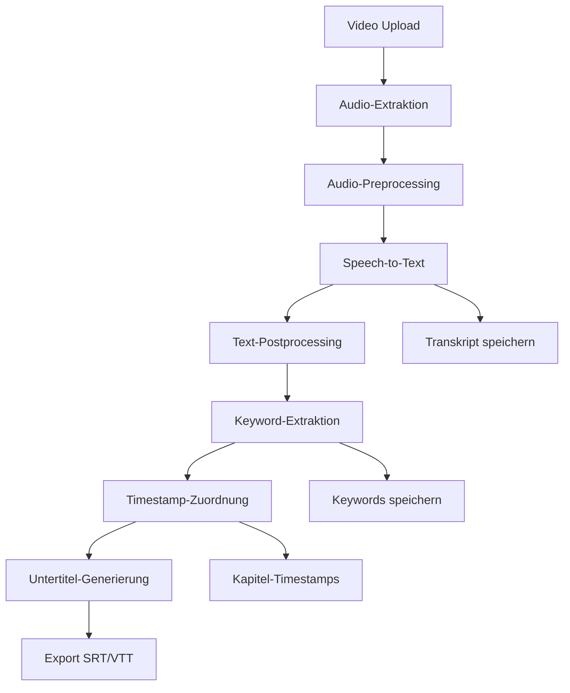

# Whisper STT Proof of Concept

Ein einfaches Python-Script zur automatischen Untertitel-Generierung aus Videos mit OpenAI Whisper.

## 🎯 Projektübersicht

Dieses Mini-MVP konvertiert Video-Dateien automatisch zu SRT-Untertitel-Dateien mit Speech-to-Text Technologie.

**Projekt:** Real-Time Media Systems  
**Team:** Yejay Demirkan, Marcus Schumann, Vasiliki Ioannidou  
**Semester:** SoSe 2025

### Features
- ✅ Video zu Audio Konvertierung (ffmpeg)
- ✅ Speech-to-Text mit OpenAI Whisper
- ✅ SRT-Untertitel Generation
- ✅ Command-Line Interface
- ✅ Keyword-Extraktion (optional)

## 🚀 Quick Start

### 1. Installation

```bash
# Python Environment erstellen
python -m venv whisper-env
source whisper-env/bin/activate  # macOS/Linux

# Dependencies installieren
pip install -r requirements.txt

# ffmpeg installieren (macOS mit Homebrew)
brew install ffmpeg
```

### 2. Erste Verwendung

```bash
# Video zu SRT konvertieren
python main.py test_videos/your_video.mp4

# Output wird gespeichert in:
# output/your_video.srt
```

## 📁 Projektstruktur

```
whisper-stt-poc/
├── main.py              # Entry point
├── audio_extractor.py   # Video → Audio
├── srt_generator.py     # Whisper → SRT
├── keyword_extractor.py # Optional keyword extraction
├── requirements.txt     # Dependencies
├── README.md           # This file
├── test_videos/        # Test files (add your videos here)
└── output/             # Generated SRTs
```

## 🔧 Usage

### Basic Usage
```bash
python main.py input_video.mp4
```

### Unterstützte Formate
- **Input:** MP4, AVI, MOV, MKV (alle ffmpeg-kompatiblen Formate)
- **Output:** SRT-Untertitel-Dateien

## 🧪 Testing

### Test-Videos hinzufügen
1. Videos in `test_videos/` Ordner kopieren
2. Script ausführen: `python main.py test_videos/my_video.mp4`
3. SRT-Datei in `output/` überprüfen

### Testing Checklist
- [ ] SRT-File öffnet sich in Video-Player (VLC)
- [ ] Untertitel sind grob synchron (±2 Sekunden OK)
- [ ] Deutsche Umlaute werden korrekt dargestellt
- [ ] Keine leeren Untertitel-Segmente

## ⚙️ Konfiguration

### Whisper Model-Größen
Im `srt_generator.py` kann das Whisper-Model angepasst werden:

```python
# Verfügbare Models (Geschwindigkeit vs. Genauigkeit):
model = whisper.load_model("tiny")    # Schnellstes
model = whisper.load_model("base")    # Standard (empfohlen)
model = whisper.load_model("small")   # Bessere Qualität
model = whisper.load_model("medium")  # Noch besser
model = whisper.load_model("large")   # Beste Qualität, langsam
```

### Sprache
Standardmäßig auf Deutsch eingestellt. In `srt_generator.py` ändern:
```python
result = model.transcribe(audio_path, language="de")  # Deutsch
result = model.transcribe(audio_path, language="en")  # Englisch
result = model.transcribe(audio_path, language=None)  # Auto-detect
```

## 🐛 Troubleshooting

### Häufige Probleme

**ffmpeg nicht gefunden:**
```bash
# macOS
brew install ffmpeg

# Ubuntu/Debian
sudo apt install ffmpeg

# Windows
# Download von https://ffmpeg.org/
```

**Whisper Model Download-Fehler:**
```bash
# Model manuell herunterladen
python -c "import whisper; whisper.load_model('base')"
```

**Encoding-Probleme bei deutschen Umlauten:**
- SRT-Files werden mit UTF-8 encoding gespeichert
- Bei Problemen Video-Player Encoding auf UTF-8 stellen

## 📈 Performance

### Typische Verarbeitungszeiten (MacBook Pro M1):
- **2-3 Min Video:** ~30 Sekunden
- **10-15 Min Video:** ~2-3 Minuten  
- **1 Stunde Video:** ~8-12 Minuten

### Optimization-Tipps:
- Nutze `tiny` model für schnelle Tests
- Nutze `base` model für Production
- GPU-Acceleration möglich mit CUDA (Linux/Windows)

## 🔮 Roadmap

### Aktueller Sprint (Tag 1-7):
- [x] Basic Video→SRT Pipeline
- [x] Command-Line Interface
- [ ] Testing mit verschiedenen Video-Längen
- [ ] Keyword-Extraktion (optional)
- [ ] README und Dokumentation

### Mögliche Erweiterungen:
- Web-Interface mit Flask/Streamlit
- Batch-Processing für mehrere Videos
- API-Endpoint für Integration
- Database für Metadaten
- Erweiterte Keyword-Analyse

## 🤝 Contributing

Dies ist ein Proof-of-Concept für ein Universitätsprojekt. 

### Development Setup:
```bash
git clone <repository>
cd real-time-media-systems
python -m venv whisper-env
source whisper-env/bin/activate
pip install -r requirements.txt
```  
**Ziel:** Automatische Untertitel-Generierung und Keyword-Extraktion für BHT-Videoplattform

---

## 1. Problemstellung und Zielsetzung

### Hauptziel
- Barrierefreie Videos durch automatische Untertitel-Generierung
- Verbesserung der Zugänglichkeit von Vorlesungsvideos
- Automatische Kapitel-Timestamps durch Keyword-Extraktion (Nice-to-have)

### Herausforderungen
- Kein direkter Zugriff auf Opencast/HRZ-System
- Deutsche Sprache mit Fachvokabular
- Verschiedene Dialekte und Sprechgeschwindigkeiten
- Integration in bestehende Plattformen (Moodle, BHT-Videoplattform)

---

## 2. Technologie-Vergleich: Speech-to-Text-Systeme

### Cloud-basierte Lösungen

#### Google Cloud Speech-to-Text
- **Vorteile:**
  - Exzellente Deutsch-Unterstützung
  - Echtzeit-Verarbeitung möglich
  - Automatische Punktuation und Diarisierung
  - Hohe Genauigkeit bei Fachsprache
- **Nachteile:**
  - Kosten bei größeren Mengen
  - Datenschutz-Bedenken (Cloud-Verarbeitung)
  - Internetverbindung erforderlich
- **Kosten:** ~$0.006 pro 15-Sekunden-Segment
- **API-Integration:** Sehr gut dokumentiert

#### Microsoft Azure Speech Services
- **Vorteile:**
  - Integrierte Keyword-Extraktion
  - Gute Deutsch-Unterstützung
  - Custom Speech Models möglich
  - Batch-Verarbeitung
- **Nachteile:**
  - Mittlere Preisklasse
  - Datenschutz-Aspekte
- **Kosten:** ~$1 pro Stunde Audio
- **Besonderheit:** Direkte Integration mit anderen Azure-Services

#### IBM Watson Speech to Text
- **Vorteile:**
  - Trainierbare Custom Models
  - Custom Dictionary für Fachbegriffe
  - Gute Enterprise-Integration
- **Nachteile:**
  - Höhere Kosten
  - Komplexere API
- **Kosten:** ~$0.02 pro Minute

### Open-Source/Lokale Lösungen

#### OpenAI Whisper ⭐ **EMPFEHLUNG**
- **Vorteile:**
  - Kostenlos und Open Source
  - Hervorragende Qualität für Deutsche Sprache
  - Läuft lokal (Datenschutz)
  - Verschiedene Model-Größen verfügbar
  - Aktive Community und Updates
- **Nachteile:**
  - Benötigt leistungsstarke Hardware für große Models
  - Keine Echtzeit-Verarbeitung
- **Models:** tiny, base, small, medium, large
- **Hardware-Anforderungen:** GPU empfohlen für large model

#### Vosk
- **Vorteile:**
  - Vollständig offline
  - Geringe Hardware-Anforderungen
  - Gute Python-Integration
- **Nachteile:**
  - Niedrigere Genauigkeit als Whisper
  - Begrenzte Deutsch-Models

---

## 3. Keyword-Extraktion: Technologien und Ansätze

### Regelbasierte Ansätze

#### spaCy + Named Entity Recognition
- **Vorteile:**
  - Lokale Verarbeitung
  - Gute Deutsch-Unterstützung
  - Erkennung von Fachbegrffen und Eigennamen
  - Team-Erfahrung vorhanden ⭐
- **Anwendung:** Extraktion von Personen, Organisationen, Fachbegriffen

#### YAKE (Yet Another Keyword Extractor)
- **Vorteile:**
  - Keine Trainingsdaten erforderlich
  - Statistische Methode
  - Gute Performance bei Fachtexten
- **Nachteile:**
  - Weniger kontextbezogen

### ML-basierte Ansätze

#### KeyBERT ⭐ **EMPFEHLUNG**
- **Vorteile:**
  - BERT-basiert, sehr gute Ergebnisse
  - Kontextbezogene Keyword-Extraktion
  - Einfache Integration mit STT-Output
  - Deutsche BERT-Models verfügbar
- **Anwendung:** Semantische Ähnlichkeit zwischen Dokument und Keywords

#### Cloud-basierte NLP-Services
- **Google Cloud Natural Language API**
- **Azure Text Analytics**
- **IBM Watson Natural Language Understanding**

---

## 4. Empfohlene Technologie-Stack

### Basis-Konfiguration (MVP)
```
Audio-Extraktion: ffmpeg
Speech-to-Text: OpenAI Whisper (medium model)
Keyword-Extraktion: KeyBERT + spaCy
Untertitel-Format: SRT/VTT
Backend: Python (Flask/FastAPI)
Frontend: React/HTML5 + JavaScript
```

### Erweiterte Konfiguration
- **STT-Alternativen:** Google Cloud Speech (für bessere Qualität)
- **Preprocessing:** Rauschunterdrückung mit librosa
- **Postprocessing:** Automatic Punctuation Restoration
- **Database:** PostgreSQL für Metadaten und Ergebnisse

---

## 5. Architektur und Workflow

### Verarbeitungspipeline



### Detaillierter Workflow

#### Phase 1: Audio-Verarbeitung
1. **Video-Input:** MP4, AVI, MOV, etc.
2. **Audio-Extraktion:** ffmpeg → WAV/MP3 (16kHz, mono)
3. **Audio-Preprocessing:** 
   - Rauschunterdrückung
   - Lautstärke-Normalisierung
   - Stille-Erkennung für bessere Segmentierung

#### Phase 2: Speech-to-Text
1. **Whisper-Verarbeitung:**
   ```python
   import whisper
   model = whisper.load_model("medium")
   result = model.transcribe("audio.wav", language="de")
   ```
2. **Output:** Transkript mit Timestamps
3. **Postprocessing:** Rechtschreibkorrekturen, Fachbegriff-Glossar

#### Phase 3: Keyword-Extraktion
1. **KeyBERT-Verarbeitung:**
   ```python
   from keybert import KeyBERT
   kw_model = KeyBERT('distilbert-base-multilingual-cased')
   keywords = kw_model.extract_keywords(transcript, 
                                       keyphrase_ngram_range=(1, 3),
                                       stop_words='german')
   ```
2. **spaCy NER:** Ergänzung um Eigennamen und Fachbegriffe
3. **Timestamp-Zuordnung:** Keywords zu Videozeiten zuordnen

#### Phase 4: Output-Generierung
1. **SRT-Generierung:** Standard-Untertitelformat
2. **VTT-Generierung:** Für HTML5-Player
3. **Keyword-Kapitel:** JSON mit Timestamps und Beschreibungen

---

## 6. Implementierungsplan (MVP)

### Sprint 1: Basis-Pipeline (2 Wochen)
- [ ] Setup Python-Environment
- [ ] Audio-Extraktion mit ffmpeg implementieren
- [ ] Whisper-Integration und erste Tests
- [ ] Basis-SRT-Export

### Sprint 2: Keyword-Extraktion (2 Wochen)
- [ ] KeyBERT-Integration
- [ ] spaCy-Pipeline für deutsche Texte
- [ ] Keyword-Timestamp-Zuordnung
- [ ] JSON-Export für Keywords

### Sprint 3: Web-Interface (2 Wochen)
- [ ] Flask/FastAPI Backend
- [ ] File-Upload Interface
- [ ] Verarbeitungs-Status und Progress-Bar
- [ ] Download-Funktionalität für SRT/Keywords

### Sprint 4: Optimierung und Tests (1 Woche)
- [ ] Batch-Processing für mehrere Videos
- [ ] Error-Handling und Logging
- [ ] Performance-Optimierungen
- [ ] Tests mit verschiedenen Videoformaten

---

## 7. Proof of Concept - Teststrategie

### Testdaten
- **3-4 Vorlesungsvideos** aus verschiedenen Fachbereichen:
  - Informatik (technische Begriffe)
  - Rechtswissenschaften (juristische Fachsprache)
  - Wirtschaft (BWL-Terminologie)
  - Ein Video mit mehreren Sprechern

### Evaluationkriterien

#### Speech-to-Text Qualität
- Word Error Rate (WER)
- Korrekte Erkennung von Fachbegriffen
- Punctuation Accuracy
- Speaker Diarization (bei mehreren Sprechern)

#### Keyword-Extraktion Qualität
- Relevanz der extrahierten Keywords
- Vollständigkeit (wurden wichtige Begriffe erfasst?)
- Präzision (sind die Keywords tatsächlich relevant?)
- Duplikat-Erkennung

### Bewertungsmatrix
| Kriterium | Gewichtung | Google Cloud | Whisper | Azure | Vosk |
|-----------|------------|--------------|---------|-------|------|
| Genauigkeit | 30% | | | | |
| Deutsch-Support | 25% | | | | |
| Kosten | 20% | | | | |
| Datenschutz | 15% | | | | |
| Integration | 10% | | | | |

---

## 8. Alternative Ansätze und Backup-Pläne

### Plan B: Hybrid-Ansatz
- **STT:** Whisper für Basis-Transkription
- **Verbesserung:** Google Cloud für kritische/schwierige Passagen
- **Keyword:** Kombination aus KeyBERT und manueller Nachbearbeitung

### Plan C: Community-basiert
- **Crowdsourcing:** Studierende können Transkripte korrigieren
- **Gamification:** Punkte für Korrekturen
- **Quality-Control:** Mehrfach-Validierung

---

## 9. Technische Anforderungen und Setup

### Hardware-Anforderungen (Minimum)
- **CPU:** 4+ Cores
- **RAM:** 8GB (16GB empfohlen für Whisper large)
- **GPU:** Optional, aber empfohlen für große Whisper-Models
- **Storage:** SSD für bessere I/O-Performance

### Software-Dependencies
```python
# requirements.txt
whisper-openai==20240930
keybert==0.8.5
spacy==3.7.5
flask==3.0.3
ffmpeg-python==0.2.0
librosa==0.10.2
pysrt==1.1.2
pandas==2.2.2
numpy==1.26.4
```

### Docker-Setup (Optional)
```dockerfile
FROM python:3.11-slim
RUN apt-get update && apt-get install -y ffmpeg
COPY requirements.txt .
RUN pip install -r requirements.txt
# ... weitere Setup-Schritte
```

---

## 10. Nächste Schritte

### Kurzfristig (nächste 2 Wochen)
1. **Setup der Entwicklungsumgebung**
2. **Erste Whisper-Tests** mit Beispielvideos
3. **KeyBERT Proof-of-Concept** 
4. **Evaluierung der Ergebnisqualität**

### Mittelfristig (1 Monat)
1. **MVP-Entwicklung** mit Web-Interface
2. **Batch-Processing** für mehrere Videos
3. **Integration verschiedener STT-Services**
4. **Umfangreiche Tests** mit Uni-Videos

### Langfristig (Semesterend)
1. **Produktive Deployment-Strategie**
2. **Integration in Moodle/BHT-Plattform**
3. **Dokumentation und Übergabe**
4. **Wartung und Updates**

---

## 11. Risiken und Mitigation

### Technische Risiken
- **Schlechte Audio-Qualität:** Preprocessing mit Rauschunterdrückung
- **Fachvokabular nicht erkannt:** Custom Dictionary, Nachtraining
- **Performance-Probleme:** Cloud-Services als Fallback

### Projektrisiken
- **Zeitengpässe:** Agiles Vorgehen, MVP-Fokus
- **Unzureichende Qualität:** Mehrere STT-Services parallel testen
- **Datenschutz-Bedenken:** Lokale Verarbeitung bevorzugen

---

## 12. Ressourcen und Links

### Dokumentation
- [OpenAI Whisper GitHub](https://github.com/openai/whisper)
- [KeyBERT Documentation](https://maartengr.github.io/KeyBERT/)
- [spaCy German Models](https://spacy.io/models/de)

### Testdaten
- Freie Vorlesungsvideos: MIT OpenCourseWare, Khan Academy
- Deutsche Universitäten: TU München, RWTH Aachen (öffentliche Lectures)

### Tools
- **Audio-Editing:** Audacity, ffmpeg
- **Evaluation:** WER-Calculation Tools
- **Deployment:** Docker, Flask, nginx

---

*Letzte Aktualisierung: [Datum]*  
*Status: In Entwicklung*